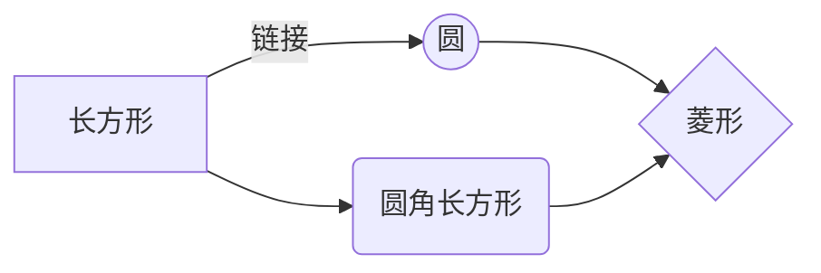

@[TOC](myabaqust)
# myabaqus
## test
>my **first** test
[link](https://img-blog.csdnimg.cn/20200129230055932.png_center).
- test
  - test
    -test
1. test
2. test
3. test
- [ ] test
- [x] test

| 第一列       | 第二列         | 第三列        |
|:-----------:| -------------:|:-------------|
| 第一列文本居中 | 第二列文本居右  | 第三列文本居左 | 

Authors
: John
: Luke

$$
\Gamma(z) = \int_0^\infty t^{z-1}e^{-t}dt\,.
$$




```mermaid
flowchat
st=>start: 开始
e=>end: 结束
op=>operation: 我的操作
cond=>condition: 确认？

st->op->cond
cond(yes)->e
cond(no)->op
```
